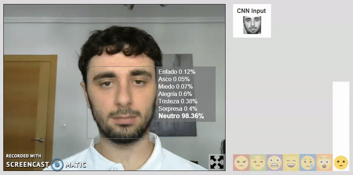
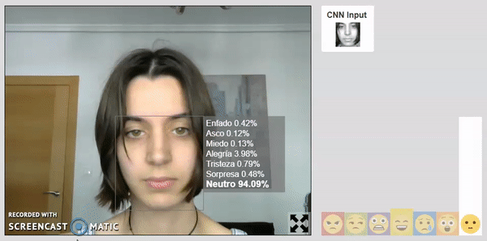
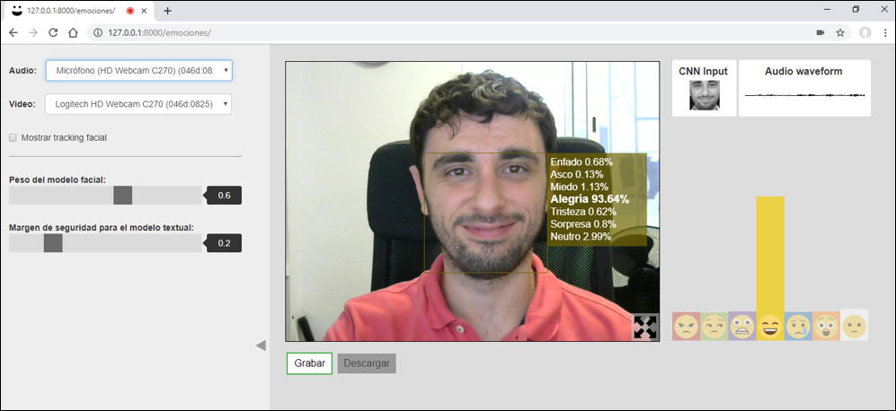

# Multimodal emotion detector
Web app in Django for multimodal emotion recognition using neural networks.

This web is an online live emotion detector in Spanish language. It uses and combines three different modalities in order to predict the emotional state of the user.
<h3>Components</h3>
The modalities used are: 

 - Facial expressions.
 - Prosodic characteristics of the voice (how are you speaking).
 - The spoken message (what are you saying).

<h3>Combination</h3>
In order to combine these models, a weighted sum of the emotion probabilities given by the facial and the vocal models is made. If the result is unclear and there is some kind of doubt between two or more emotions, the message model is used to clarify this doubt.
<h3>Language</h3>
The vocal and textual models are trained with Spanish data, so this classifier may not work properly if used in other languages.
<h3>Emotion model</h3>
The emotional model used for this classifier is the classic discrete Paul Ekman's classification of 7 basic emotions:

 - Anger
 - Disgust
 - Fear
 - Happiness
 - Sadness
 - Surprise
 - Neutral
<h3>Neural networks</h3>
The neural networks corresponding to the three used modalities are private. The ones available publicly in this repository are deteriorated versions of the original ones.
<h3>Additional functionalities</h3>
The app also allows to record live sessions of emotion detection and download the video afterwards.

In order to make it more visual and identify the emotions easily, each emotion is related in the app with one color and one emoji:
 - Anger -> Red
 - Disgust -> Green
 - Fear -> Purple
 - Happiness -> Yellow
 - Sadness -> Blue
 - Surprise -> Orange
 - Neutral -> White
<h3>Available app</h3>
A lite version of this app is available at: https://tfm-emotions.herokuapp.com/emotions/
As heroku free plan limits the memory available, this public version only includes the facial emotion, which is in fact the most representative one.
<h3>Screenshots</h3>
The screenshots show the texts of the app in Spanish as the app was initially fully designed in Spanish. Right now these texts are transcribed and the texts of the available app and the code in this github are fully in English.

<h2>Credits</h2>
Some external tools were used to develop this recognizer.

The face detector that it is used to locate and crop the face in the image is the one available at https://github.com/auduno/clmtrackr

The voice transcriptor used to get the spoken message from the voice is the one available at https://github.com/Uberi/speech_recognition
